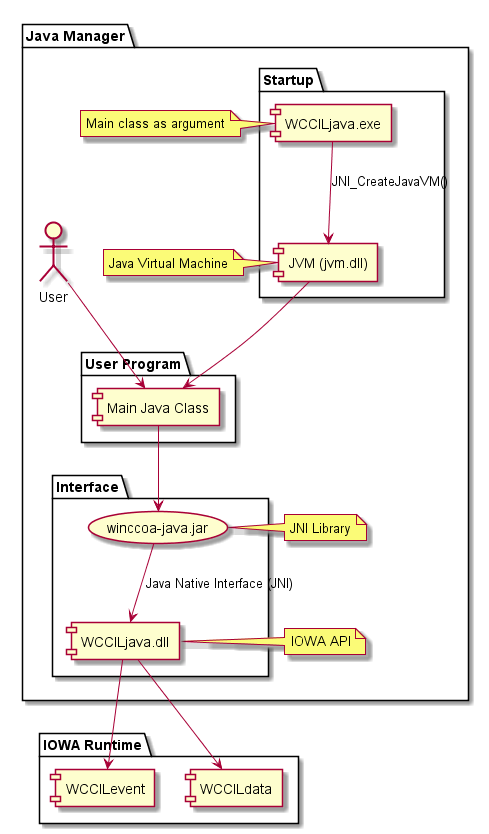

# Contents
1. [Introduction](#introduction)
1. [Compile C++ Components](#c++)  
1. [Compile Java Components](#java)
1. [Java Manager Startup](#start)
1. [Java Manager Configuration](#config)
1. [Examples](#examples)
    1. [Java](#java-examples)
    1. [Scala](#scala-examples)
    1. [Clojure](#clojure-examples)
  

# Introduction <a name="introduction"></a>
The Java Manager consists of three components:
* The C++ Runtime Part  
  - WCCILjava.exe
  - WCCILjava.dll

* The Java Runtime Part (oa4j)
  - winccoa-java.jar

* The user designed program in Java
  - .class or .jar files



# Compile C++ Components <a name="c++"></a>

* Get the API of the Runtime  
  Example: D:\Workspace\<Source>
  
* Get the sources of oa4j\Native\ManagerV4  
  Example: D:\Workspace\oa4j\Native\ManagerV4

* Download and Install Java SE 8 JDK  
  https://www.oracle.com/technetwork/java/javase/downloads/index.html


* Change to API source directory and set environment
  ```
  cd D:\Workspace\<Source>\src
  senv
  ```
* Set JAVA_HOME to your jdk installation path
  ```
  set JAVA_HOME=C:\Program Files\Java\jdk1.8.0_221
  ```

* Set APIS_ROOT to your API sources (**Remark**: use "/" and not backslashes)
  ```
  set APIS_ROOT=D:/Workspace/<Source>/src
  ```

* Go to source directory and compile the Java Manager
  ```
  cd D:\Workspace\oa4j\Native\ManagerV4
  make.bat exe
  make.bat dll
  ```

# Compile Java Components <a name="java"></a>
You can use [IntelliJ IDEA](https://www.jetbrains.com/idea/) to open the project and build the artifact (.jar) or you can use maven from command line to build the library.
* Download and Install Java SE 8 JDK  
  https://www.oracle.com/technetwork/java/javase/downloads/index.html

* Add the path to the jvm.dll of your Java installation to the PATH environment variable  
  ```
  set PATH=%PATH%;C:\Program Files\Java\jdk1.8.0_221\bin\server
  ```
	
* Download GIT  
  https://git-scm.com/download  
  ```
  mkdir D:\Workspace, cd C:\Workspace  
  git clone https://github.com/vogler75/oa4j.git  
  ```
   
* Download Apache Maven  
  https://maven.apache.org/download.cgi  
  Copy content of zip to e.g. C:\Tools\apache-maven-3.6.2  
   
* Build Java Library (internet connection required)
  ```
  set PATH=%PATH%;C:\Tools\apache-maven-3.6.2\bin  
  set JAVA_HOME=C:\Program Files\Java\jdk1.8.0_221  
  cd D:\Workspace\oa4j\Java
  copy make.sh make.bat
  make.bat
  ```
  The artifact named *winccoa-java-1.0-SNAPSHOT.jar* can then be found in the directory "lib". 
  Rename the file to *winccoa-java.jar* 


# Java Manager Startup <a name="start"></a>
The Executable WCCILjava.exe starts up a JVM and the JVM is calling native IOWA (C++) functions to startup the manager and do the native IOWA communication. That's why we need the DLL. You can also startup the JVM directly without executing the WCCILjava.exe.

* Download and Install Java SE 8 JDK or JRE
  https://www.oracle.com/technetwork/java/javase/downloads/index.html

* Add the path to the jvm.dll of your Java installation to the PATH environment variable and also add the WinCCUnified bin directory to the PATH variable:
  ```
  set PATH=%PATH%;C:\Program Files\Java\jdk1.8.0_221\jre\bin\server
  set PATH=%PATH%;C:\Program Files\Siemens\Automation\WinCCUnified\bin
  ```

* Copy the C++ Runtime to the WinCCUnified bin directory
  ```
  copy /y Z:\Workspace\oa4j\Native\ManagerV4\win64vc15\release\* "C:\Program Files\Siemens\Automation\WinCCUnified\bin\"
  ```
* Copy the Java Runtime to the WinCCUnified Project bin directory (replace *HMI_RT_1-SIM* with your project name)
  ```
  copy /y Z:\Workspace\oa4j\Java\lib\winccoa-java.jar C:\ProgramData\SCADAProjects\HMI_RT_1-SIM\bin
  ```
* Start the Java Manager from Command-Line. You can find the project id in the SIMATIC Runtime Manager, if it is a simulation project you have to add "-SIM" at the end of the project id. Your classes and jar's must be located in the project bin directory, or you can also pass full paths at the commandline (-cp ...)
  ```
  WCCILjava -proj 08ae7439-cd23-4780-96fd-8ba337c0685b-SIM -cp bin\winccoa-java.jar -c ApiTestDpGet  
  
  WCCILjava -proj 08ae7439-cd23-4780-96fd-8ba337c0685b-SIM -cp bin\winccoa-java.jar;bin\wss.jar -c wss/Server
  ```

* Logs can be found in the project log directory:
  ```
  Get-Content -Tail 10 -Wait -Path C:\ProgramData\SCADAProjects\HMI_RT_1-SIM\log\WCCILjava1.0.log
  ```

# Java Manager Configuration <a name="config"></a>
## Command Line Arguments
* -proj  
  runtime project name/id *-proj 08ae7439-cd23-4780-96fd-8ba337c0685b-SIM* 

* -num   
  Set manager number

* -path  
  Set project directory (optional)

* -debug  
  Show some detailed debug outputs

* -userdir | -ud  
  -Duser.dir, default value is the project directory

* -libpath | -lp  
  -Djava.library.path for jvm; defaults to project bin directory and unified installation bin directory (WCCILjava.dll must be located in one of those directories) 

* -classpath | -cp  
  -Djava.class.path for jvm; defaults to the bin directory of the project

* -class | -c  
  Initial class to load & start. This class must have a "public static void main(String[] args)" function. If this argument is not set then the manager will try to load a class named "Main".

## Config File Settings
Configuration can also be done in the config file
* config
* config.level
```
[java]
# java user dir (-Duser.dir), defaults to project directory
userDir = "<project-dir>"

# java library path (-Djava.library.path), defaults to the project bin directory, WCCILjava.dll must be located there
libraryPath = "<project-dir>/bin" 

# java class path (-Djava.class.path), defaults to project bin directory
classPath = "bin;bin/winccoa-java.jar"

# if you have long class paths you can use a file
#configFile = "config.java"
```

* config.java 
```
-Duser.dir=
-Djava.class.path=
-Djava.library.path=
```

# Examples Programs <a name="examples"></a>
## Java <a name="java-examples"></a>
### DpGet 
```
import at.rocworks.oa4j.base.JClient;
import at.rocworks.oa4j.base.JDpMsgAnswer;
import at.rocworks.oa4j.base.JManager;
import at.rocworks.oa4j.base.JDebug;

public class ApiTestDpGet {
    public static void main(String[] args) throws Exception {
        JManager m = new JManager();
        m.init(args).start();
        new ApiTestDpGet().run();
        m.stop();        
    }      
    
    private void run() throws InterruptedException {
        JClient.dpGet()
                .add("HMI_Tag_1.:_online.._value")
                .add("HMI_Tag_Text.:_online.._value")
                .action((JDpMsgAnswer answer)->{
                    JDebug.out.info(answer.toString());
                })
                .await();
    }
}
```
### DpConnect
```
import at.rocworks.oa4j.base.JClient;
import at.rocworks.oa4j.base.JDpConnect;
import at.rocworks.oa4j.base.JDpHLGroup;
import at.rocworks.oa4j.base.JDpMsgAnswer;
import at.rocworks.oa4j.base.JManager;
import at.rocworks.oa4j.base.JDebug;

public class ApiTestDpConnect {    

    private Integer val = 0;

    public static void main(String[] args) throws Exception {
        JManager m = new JManager();
        m.init(args).start();
        new ApiTestDpConnect().run();
        m.stop();
    }
    
    public void run() throws InterruptedException {
        JDebug.out.info("dpConnect...");
        JDpConnect conn = JClient.dpConnect()
                .add("HMI_Tag_1.")
                .action((JDpMsgAnswer answer)->{
                    JDebug.out.info(answer.toString());
                })                
                .action((JDpHLGroup hotlink)->{
                    val=hotlink.getItemVar(0).toInt();
                    JDebug.out.info(val.toString());
                })
                .connect();
        
        JDebug.out.info("sleep...");
        while (val>=0) // loop while value is bigger than 0
            Thread.sleep(1000);
        JDebug.out.info("done");
        conn.disconnect();
        JDebug.out.info("end");
    }          
}
```
## Scala Examples <a name="scala-examples"></a>
```
import at.rocworks.oa4j.base._
import at.rocworks.oa4j.`var`._

object Test {
  def main(args: Array[String]) {
    val m = (new JManager).init(args)
    m.start()
    runSet()
    runGet()
    runConnect()
    m.stop()
  }

  def runGet(): Unit = {
    val v1 = JClient.dpGet.add("ExampleDP_Trend1.").await()
    JDebug.out.info(v1.toString)

    val v2 = JClient.dpGet("ExampleDP_Trend1.");
    JDebug.out.info(v2.toString)

    val v3var = new VariablePtr()
    val v3ret = JClient.dpGet("ExampleDP_Trend1.", v3var);
    JDebug.out.info(s"v3: ret=$v3ret value="+v3var.get.toString)
  }

  def runSet(): Unit = {
    JClient.dpSet()
      .add("ExampleDP_Trend1.", new FloatVar(1))
      .add("ExampleDP_SumAlert.", "hello world!")
      .send()
    Thread.sleep(1000);

    JClient.dpSet("ExampleDP_Trend1.", 2.0);
    Thread.sleep(1000);

    JClient.dpSet("ExampleDP_Trend1.", new FloatVar(3))
    Thread.sleep(1000);

    JClient.dpSetWait("ExampleDP_SumAlert.", "Hello Scala world!")
    Thread.sleep(1000);
  }

  def runConnect() {
    JDebug.out.info("dpConnect...")

    val conn = JClient.dpConnect.add("ExampleDP_Trend1.")

    conn.answer((answer) => {
        JDebug.out.info(answer.toString())
      }
    )

    conn.hotlink((hotlink) => {
        JDebug.out.info(hotlink.toString())
      }
    )

    conn.connect()
    Thread.sleep(1000 * 60)
    conn.disconnect()
  }
}

```
## Clojure Examples <a name="clojure-examples"></a>
```
(ns at.rocworks.oa4j.core
  (:import (at.rocworks.oa4j.base JClient JManager IHotLink)))

; clojure style functions for oa4j
(defn hl [f] (reify IHotLink (hotlink [this hotlink] (f hotlink))))

(defn dpConnect [dps callback]
  (let [f (JClient/dpConnect)]
    (doall (map #(.add f (name %)) dps))
    (.hotlink f (hl callback))
    (.connect f)))

(defn dpSet
  ([kv] (let [f (JClient/dpSet)]
            (doall (map (fn [[k v]] (.add f (name k) v)) kv))
            (.send f)))
  ([k v] (JClient/dpSet (name k) v)))

(defn dpGet [dps]
  (if (or (set? dps) (sequential? dps))
    (let [res (JClient/dpGet (map #(name %) dps))]
      (map #(.getValueObject %) res))
    (let [var (JClient/dpGet (name dps))]
      (.getValueObject var))))

; callback function sums up all values and set the sum to a dp
(defn callback [xs]
  (let [v (reduce #(+ %1 %2) (map #(.getValueObject %) xs))];
    (dpSet :ExampleDP_Trend1. v)))

; manager instance
(def manager (new JManager))

; main
(defn -main [& args]
  ;(-> manager (.init (into-array args)) (.start))
  (.init manager (into-array args))
  (.start manager)

  ; dpGet
  (println "dpGet with str: " (dpGet :ExampleDP_Arg1.))
  (println "dpGet with set: " (dpGet #{:ExampleDP_Arg1. :ExampleDP_Arg2.}))
  (println "dpGet with seq: " (dpGet [:ExampleDP_Arg1. :ExampleDP_Arg2.]))

  ; dpGet and dpSet
  (let [[a1 a2] (dpGet [:ExampleDP_Arg1. :ExampleDP_Arg2.])]
    (dpSet {:ExampleDP_Arg1. (+ 1 a1) :ExampleDP_Arg2. (+ 1 a2)}))

  ; dpConnect
  (let [c (dpConnect [:ExampleDP_Arg1. :ExampleDP_Arg2.] callback)]
    (Thread/sleep 180000)
    (.disconnect c))

  (.stop manager))
  ```
